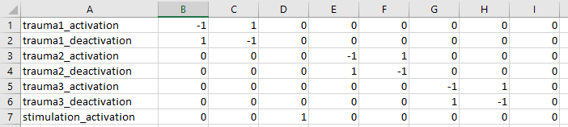

# pet_analysis toolbox code explanation

## Table of Contents
1. [General Function](#general_function)
2. [Pre-Processing Pipeline](#pre_processing)
3. [Example Pre-Processing Set Up](#ex_pre)
    1. [Individual Contrast Set Up](#ind_set_up)
4. [Analysis Pipline](#analysis_pipeline)

## General function of code <a name="general_function"></a>
The code is separated into two main components: dat
a cleaning and analysis. All scripts can be accessed natively through the MATLAB terminal by adding folder to path (assuming the folder is in your documents folder:
```matlab
addpath(genpath('~/Documents/pet_analysis'));
```
The general structre of the toolbox is such:

Folder | Purpose
------------ | -------------
cluster_finding | 
correlation_analysis | 
main_analysis |
pre_processing |
utilities | Functions to help ease import of directories and small processing tasks

## General Set Up for PET analysis
The two main folders needed for PET analysis are in ```pre_processing``` and ```main_analysis```. Additionally, for each study, there are a few files and a pipeline needed. Below is a quick checklist for setting up a new study. The functions below will be described in more detail.

File/Folder | Completed
------------|------------
**pre_processing**|
```step_1_1_realign_and_estimate.m```|
```step_1_2_normalize.m```|
```step_1_3_smooth.m```|

### Pre-Processing Pipeline <a name="pre_processing"></a>
**Step 1** is a set of functions which will automate the pre-processing steps. They are labeled with ```step_1_n``` where ```n``` is a sub-step of pre_processing. Exact details can be found within the ```.m``` file itself, but a summary of the 'design choices' will be presented along with a quick description. 

#### ```step_1_1_realign_and_estimate.m```: 
Arguments | Description
---|---
x| character of subject name - in my pipelines I extracted from data folders, so it reflected name of folder
y| path where individual subject data goes

**Function Returns:** Average image file for subject with the suffix, ```realigned_summed```

This function is essentially the image calculator utility from SPM. It starts by looking for all the raw PET files (.nii) in the subject folder. It loads all the files, creates an **average image** based on the scans available using an expression customized to the number of files for the estimation (e.g., if 3 scans: (Scan1 + Scan2 + Scan3)/ 3). 

This function uses the default variables, but in case they change in new SPM versions, they are:
* Data Matrix: No - don't read images into matrix
* No implicit zero mask
* Tri-linear interpretation
* INT16 data type

#### ```step_1_2_normalize.m```: 
Arguments | Description
---|---
x| character of subject name - in my pipelines I extracted from data folders, so it reflected name of folder
y| path where individual subject data goes
z| path to a template image - in this case '[location of MATLAB installation]/MATLAB/spm8/templates/PET.nii,1'

**Function Returns:** Copy of the raw data with a ```w``` prefix.

This function will run the image normalization step ('Old Normalize Estimate and Write' in SPM12). First, the individual scans are read in (.img files). Second, the mean image from step_1_1 (.nii file) is brought in. 

All default options are selected. In case they change, the screenshot below details the options.  


#### ```step_1_3_smooth.m```: 
Arguments | Description
---|---
x| character of subject name - in my pipelines I extracted from data folders, so it reflected name of folder
y| path where individual subject data goes

**Function Returns:** Smoothed version of each scan with a ```sw``` prefix.

This function is will read in the ```w``` prefix image file from normalization step and smooth it. This function uses a [5 5 5] full width half maximum Gaussian smoothing kernal with SAME data tyle and no implicit masking. The filename prefix is set as ```s```.

#### ```step_1_4_difference_images.m```: 
Arguments | Description
---|---
subject | character of subject name - in my pipelines I extracted from data folders, so it reflected name of folder
subject_files | path where individual subject data goes
scan_characteristics | A double with size n x 2, where n = number of different HR-PET scans
measure_name| a string with the name of stress intervention. For use in the contrast specification
contrasts| detailed below; individual contrast specifications
var | 0 or 1 - equal variance. Default runs with 1 in individual model specification; 0 will run otherwise
contrast_sum| a double of length n where n = number of contrasts specified. In the double is the sum of the contrasts. For examples, a contrast testing if A is greater than B would be [-1 1] for a contrast sum of 0. A contrast just looking at activation of A would be [1 0] (B is disregarded) and therefore has a contrast sum of 0.

**Function Returns:** Individual model SPM file with associated contrast maps (con_0001.nii) and contrast t values (spmT_0001.nii). 

This is the 'main' function within the individual data pre-processing. Importantly, **this step requires customized inputs tailored for the specific study**, which will be described in greater detail below when talking about the generation of a study-specific pipeline. Specific to this function, it looks for the ```sw``` prefix files, which are the final output for the image pre-processing. This function then sets up a basic flexible factorial model *for the specific subject* which is used to get their level of activation, deactivation, etc during different points of the experiment. There is also an error file written, ```subject_errors.txt``` placed in the study directory, which returns errors for specific contrasts (mainly during issues with lack of PET data). 

The ```var``` argument, noted above, indicates whether the variance in the factor (the second column of ```scan_characteristics```) is equal or unequal. By default, we want this to be true. However, some individual models will fail with this specification. Therefore, in order to avoid this, the function is called twice in the pre-processing pipeline with a ```try-catch``` sequence. This will try the model using equal variance (var = 1) and if not, try the model with unequal variance (var = 0). This specification is found in the line: ```matlabbatch{1}.spm.stats.factorial_design.des.fblock.fac.variance = var;```. If there are further errors, this will be returned in a variable ```errors``` printed to the workspace. It is advised to look at this after running all participants through the pipeline.

## Example Pre-Processing Stream <a name="ex_pre"></a>

This section will demonstrate how to use the `step_1_pre_processing_shell.m` for any study. 

### Sourcing Files
`clear; 
addpath(genpath('PATH TO PET_ANALYSIS LIBRARY'));`

Replace the string with the location of the pet_analysis folder from this Git repository. 

### Naming the relevant directories and initializing jobman
Here, we are telling the script where important files are.

`subj_files = 'SUBJECT_DATA_LOCATION;`
This is the location of the raw files live (eg. `'C:/Users/mattw/Documents/Research/darpa/data/subject_data_regression/'`). They should be converted (using Jon's script) from the `.v` file and are generally named: `[subj#]_w[scan#]_[date and maybe other info]` and will have a `.img` (image) and `.hdr` (header) file. Make sure each scan has two files. Nothing else should be in the folder. For the original DARPA study, if a participant completed the entire protocol (14 scans), this folder would have 28 files and that is all. Anything else in this folder may break the script. Additionally, the script is set up to run with the data in this format. If the data is not in this format, the script may break. 

```matlab
ind_contrasts_file = 'LOCATION_OF_XLSX_FILE';
scan_characteristics = cat(1,'SCAN_CHARACTERISTICS_DOUBLE');
[~,~,contrasts] = xlsread(ind_contrasts_file);
contrast_sum = [CONTRAST_SUMS];
```

#### Setting up Individual Contrast file <a name="ind_set_up"></a>
This is one of the main components of the individual model set-up. This is where you will specify the neutral, mental/traumatic stress, vns-only, etc. scans. The first question you need to decide is how to analyze the data, and **how many unique components of the scanning protocol exist**.

For example, the simplist representation of the PPG experiment is:

```
Neutral -> Neutral -> Neutral -> Neutral -> Mental Stress -> Mental Stress -> Mental Stress -> Mental Stress
```
As a result, we have **2 unique components** - Neutral and Mental Stress. Keep this is mind, as it will be needed later. Since we know the unique components in the dataset, we will construct the contrast matrix for the first level (individual) analysis. The most basic version will be 2 columns and an arbitrary rows (depending on what you are interested in). For the purposes of this example, *activation = Mental Stress - Neutral* and *deactivation = Neutral - Mental Stress*.

**Experimental Components:**

*Table*:
**name**|**Neutral**|**Mental Stress**
---|---|---
Activation|-1|1
Deactivation|1|-1

Knowing this, we will create an excel file using the matrix for importing into MATLAB. For this **do not include column headers** - in this example, cell A1 should be 'Activation'. 

*Scan Characteristics Double:*
This will specify levels for each scan to tell the script. So, you will need to create an n x 2 double using the `cat` function with `1` option (to concatenate by rows). For the current example, the code would look like this:

`scan_characteristics = cat(1, [1 1], [2 1], [3 1], [4 1], [5 2], [6 2], [7 2], [8 2]);`

*Contrast sums:*
This will be a double with the length = n rows in *Table* with the sum of each row. Most of the time, this will be zero. In this example, this would be the code:

`contrast_sum = [0,0];`

What if we wanted to get a lit more complex? We know in the PPG that subjects received mental stress that was mental arithmetic and public speaking. We can add this complexity to our model using the model below.

```{sequence}
Counting -> Counting -> Neutral Speaking -> Neutral Speaking -> Mental Arith. -> Mental Arith. -> Public Speaking -> Public Speaking
```

Now we have **4 unique components** (counting, neutral speaking, mental arith., and public speaking). Our contrast table will look a little different. For this purpose, we will order our unique components in order of appearance (1 = counting, 2 = neutral speaking, 3 = mental arith., 4 = public speaking). 

**name**|**Counting**|**Neutral Speaking** | **Mental Arith** | **Public Speaking**
---|---|---|---|---
Activation|-1|-1|1|1
Deactivation|1|1|-1|-1
Public Speaking Activation|0|-1|0|1
Public Speaking Deactivation|0|1|0|-1
Mental Arith Activation |-1|0|1|0
Mental Arith Deactivation |1|0|-1|0

Our excel table would then have 6 columns and 5 rows (A1 = 'Activation'). We can still get the overall Activation and Deactivation in this model, but will additional detail for the type of stress. **NOTE: in PPG, the stress type was random**. In order to do this, you will need to get the order of appearance in an excel file. I'll show how to address this later. 

*Scan Characteristics:* `cat(1, [1 1], [2 1], [3 2], [4 2], [5 3], [6 3], [7 4], [8 4])` 

*Contrasts Sums:* `[0,0,0,0,0,0]`

Lastly, for the DARPA study VNS we had this approach:

```
Neutral -> Neutral -> Trauma -> Trauma -> VNS -> VNS -> Neutral -> Neutral -> Trauma -> Trauma -> {lunch} -> Neutral -> Neutral -> Trauma -> Trauma
```

On the surface we have 3 unique components (neutral, trauma, VNS). However, there is one issue. The first trauma script **does not have VNS preceding**. Therefore, we have to discard it because it isn't like the others. We do this by specifying that we have 4 unique components. Therefore, this analysis would look like:

**name**|**Neutral**|**Trauma** | **VNS**
---|---|---|---
Trauma Activation|-1|1|0
Trauma Deactivation|1|-1|0
VNS Activation |0|0|1
VNS Deactivation |0|0|-1

What happened to the first trauma? I called this the 4th unique component. If you do not specify it in the model, SPM will automatically add a 0. Therefore, by giving it a value of 4, it will be ignored and essentially discarded. You could also remove the scan from the subject's individual folder. However, I like to keep everything included in the model especially with smaller sample sizes. 

*Scan Characteristics:* `cat(1, [1 1], [2 1], [3 **4**], [4 2], [5 3], [6 3], [7 1], [8 1], [9 2], [10 2], [11 1], [12 1], [13 2], [14 2])` 

*Contrasts Sums:* `[0,0,**1**,0]`

Lastly, we can also include a time analysis. With the non-PTSD paper, I also did a time-based analysis. For this, **8** components were needed:

```
Neutral_1 -> Neutral_1 -> Trauma_7 -> Trauma_1 -> VNS -> VNS -> Neutral_2 -> Neutral_2 -> Trauma_2 -> Trauma_2 -> {lunch} -> Neutral_3 -> Neutral_3 -> Trauma_3 -> Trauma_3
```
The resulting table looked like this in excel:



*Scan Characteristics:* `cat(1, [1 1], [2 1], [3 8], [4 2], [5 3], [6 3], [7 4], [8 4], [9 5], [10 5], [11 6], [12 6], [13 7], [14 7])` 

`spm_jobman('initcfg');` This insitiates the jobman in SPM. A leftover from SPM8, it can possibly be removed. However, it doesn't impact the SPM12 jobman in any way, so its just left for the time being. 

### Getting list of subjects to iterate over
This section will just loop through the subject file directory and, using the folder structure, create a list of subjects to be included. Nothing should need to be altered here. 

### Routine for pre-processing
I will describe this section is pseudocode, which is a plain-text version of what the code is doing.

```for all subjects in the list created above
    try #to avoid crashing the script - an error is returned to the 'error' array created above
        clear jobs in jobman
        
        get subject number
        print out what subject to console
        
        get subject directory (where files are)
        change MATLAB to look at the subject directory
        
        Check if pre-processing has been done already by looking for the 'sw' files
        Check if pre-processing has been done already by looking for a con_00**.nii image (from SPM)
        
        if neither pre-processing checks find anything (the variable is empty)
            Do step_1_1 (realign and estimation)
            run SPM Jobman for step_1_1
            
            locate SPM PET template image - THIS NEEDS TO BE SPECIFIED and should be in MATLAB/spm8/templates/PET.nii
            do step_1_2 (normalizing)
            run SPM Jobman for step_1_2
            
            do step_1_3 (smoothing)
            run SPM Jobman for step_1_3
            
            if pre-processing checks return either sw_ image or con_00**, print out this to console
```

### Computing Difference Images
Since we have now put everything together, the final step is to call the function for computing difference images, `step_1_4`. First, this loop will check if the difference images are empty (no con_000#.nii) images. If that is empty, it will compute the difference images.

```matlab
difference_images = step_1_4_difference_images(subject, ...
                                               subj_files,...
                                               scan_characteristics,...
                                               'STRESS_OR_OTHER_DESCRIPTOR',...
                                               contrasts,...
                                               1,...
                                               contrast_sum);
```


## Analysis Pipeline <a name="analysis_pipeline"></a>

The next step is to run the main second-level analysis (generally referred to as Step 2). For this, it generally works best to create a new ```.m``` file usually containing some version of `analysis` to differentiate it from the `pre-processing`. For example, in the DARPA study, the main analysis `.m` file was called, "`darpa_analysis_pipeline.m`". This section will go through that code and some of the functions contained within.

### The easiest way to create a new analysis will be modifying the `analysis_pipeline_SHELL.m` file.

#### *Preamble* - First, just setting up some directories and file ID. 

```matlab
%% Identify subject and analysis file directory
subject_files = 'PATH TO FOLDER WITH SUBJECT DATA THAT INCLUDES {SUBJID}/con_0001.nii FILES';
subject_groupings = xlsread('C:/Users/.../.../.../subject_groupings.xlsx');

% Getting list of subjects
subjects = dir(subject_files);
subjects = remove_dots(subjects); % Removing first two rows
subjects = remove_imaging_files(subjects);
subjects = {subjects.name}.'; %.' fills vertically

% Read in contrast excel file
[~,~,contrasts] = xlsread('C:/Users/.../.../.../contrasts_darpa.xlsx');
```

This script uses two main external files - contrasts and subject groupings - which will be necessary to complete the desired analyses. 

##### 1. Subject Grouping File

The subject grouping file identifies each subject and what groups they belong to for the second level analyses. For example, in the DARPA study, an easy structure was PTSD vs non-PTSD and sham vs. VNS. The general structure of the file is: each subject's information is contained within one row with each column containing information for each group as demonstrated below:

| subject | PTSD | sham |
| ------- | ---- | ---- |
| 1       | 1    | 1    |
| 2       | 1    | 2    |
| 3       | 2    | 2    |
| 4       | 2    | 1    |

*Note*: the numbers are arbitrary, but MATLAB does not play friendly with 0's and 1's (which are generally used for binary). I like to generally follow the idea of the number coding being essentially 1 = no, 2 = yes (essentially coding as [0,1] binary but +1). 

##### 2. Contrasts File

This contrast file is essentially the same as the one from [Step 1](#ind_set_up), so much of the underlying detail will be omitted here. The one fix here is that you can have *n* number of factors, so the order of presentation requires attention. The number of columns in the excel file is equivalent to: *f(x)* = *1 + L1* * *L2* * *L3*...*Ln* where L = the number of levels for each *n* factor.  Therefore, if you have two factors, one with 2 levels (e.g., PTSD vs non-PTSD) and another with 3 levels (e.g., rest, stimulation, trauma) you will need 7 columns (1 for name, 2x3 for contrasts). Therefore, each of the 6 data columns will be a unique combination of factor levels.  

The order will also follow a general pattern which also dictates the contrast. A nice diagram of these (along with more examples) can be found in the [Glascher and Gitelman paper](https://www.researchgate.net/publication/267779738_Contrast_weights_in_flexible_factorial_design_with_multiple_groups_of_subjects). In short, the order will permutate each level of the second factor over the first. If we have the same levels as stated above, let PTSD = A1, non-PTSD = A2, Rest = B1, Stimulation = B2, Trauma = B3. The order of appearance is then: A1B1 | A1B2 | A1B3 | A2B1 | A2B2 | A2B3. However, in general it is best to double check this in the `.SPM` file at the location: `>> SPM.xX.name`. 

Quick Example (not exhaustive table, just representative): 2 (PTSD, non PTSD) x 2 (rest, trauma)

|                                 | PTSD,Sham | PTSD,Active | Non-PTSD,Sham | Non-PTSD,Active |
| ------------------------------- | --------- | ----------- | ------------- | --------------- |
| sham > active                   | 1         | -1          | 1             | -1              |
| active > sham                   | -1        | 1           | -1            | 1               |
| non_PTSD_active > non_PTSD_sham | 0         | 0           | -1            | 1               |
| PTSD_active > PTSD_sham         | -1        | 1           | 0             | 0               |

#### Covariates

If you want to include covariates, there is a third file that is needed to enable the analytical pipeline to employ within the analysis. Note, you could amend the script to load in with the first subjects grouping file, but because data was coming from different places, I decided to keep the files separate. This file is set up similarly, with each subject data being in one row and data in each column. Also, you **do not** need to crop this file to fit exactly what you want. In the code itself you can specify which columns are the covariates of interest.

For example, this is a brief part of a recent file:

| caps_index | biol_sex | bmi  | age  | marital_status |
| ---------- | -------- | ---- | ---- | -------------- |
| 101        | 2        | 19.7 | 27.3 | 1              |
| 102        | 2        | 21.6 | 21.6 | 1              |
| 103        | 2        | 20.8 | 24.8 | 1              |
| 104        | 2        | 23.3 | 28.0 | 2              |

Here is the code for this section:

```matlab
%% Adding covariates
% For ex: Columns of interest- 3 (gender), 18 (age)
covariate_data = xlsread('C:/.../.../{file_name}.xlsx');
covariate_data = covariate_data(:,[1,3,18]); % takes the whole file and returns 3 columns - 1 (subject ID), 3 (gender), 18 (age)
[nrow,ncol] = size(covariate_data); # gets size of data
[~,grouping_factors] = size(subject_groupings); % returning the number of factors

% Looping over and adding to subject_groupings
for s = 1:length(covariate_data)
    sub = covariate_data(s,1);
    
    % Getting row in subject grouping file
    row = find(subject_groupings == sub,1);
    
    % Adding data from covariates to subject_groupings
    for cc = 2:ncol
        cov = covariate_data(s,cc);
        %-1 because we are starting to count at 2, +cc for the count
        subject_groupings(row,(grouping_factors-1+cc)) = cov;
    end
    
end
    
% Adding names - you will want to change both the names and length (if you have > 2)
cov_names = {'sex','age'};
```

#### Running over analysis

First, specify the "runs" you want to do.  For example, this could be {"activation", "deactivation", "vns"}. Typically, these runs correspond to a contrast from the individual-level pre-processing above. Remember, the pre-processing script creates individual contrast images (e.g., con_0001.nii). These images files will be used in the analysis. In general, this section of the code will essentially loop through each run and execute a separate analysis run. 

1. First, name each run. Then the for loop is started

```matlab
%% Looping over activation, deactivation, VNS
runs = {'RUN1_NAME', 'RUN2_NAME', 'RUN2_NAME'};

for run = 1:length(runs)
```

2. This block of code will tell the script which contrast file corresponds to each image.

```matlab
% brain activity type
    analysis_type = cell2char(runs(run));
    
    % Getting subject images
    if strcmp(analysis_type,'activation')
        subj_images = 1;
    elseif strcmp(analysis_type,'deactivation')
        subj_images = 2;
    else
        subj_images = 3;
    end
```


## Utilities

```dir to list```: Takes in a directory (data_dir) and will output a list of all the directories in that list. Useful for getting individual subject lists from folders in a directory. Output can take a couple of formats depending on what is needed.


