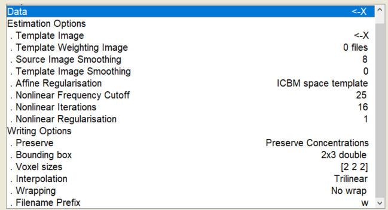

# pet_analysis toolbox code explanation

## Table of Contents
1. [General Function](#general_function)
2. [Pre-Processing Pipeline](#pre_processing)
3. [Example Pre-Processing Set Up](#ex_pre)
3.1 [Individual Contrast Set Up](#ind_set_up)

## General function of code <a name="general_function"></a>
The code is separated into two main components: data cleaning and analysis. All scripts can be accessed natively through the MATLAB terminal by adding folder to path (assuming the folder is in your documents folder:
```matlab
addpath(genpath('~/Documents/pet_analysis'));
```
The general structre of the toolbox is such:

Folder | Purpose
------------ | -------------
cluster_finding | 
correlation_analysis | 
main_analysis |
pre_processing |
utilities | Functions to help ease import of directories and small processing tasks

## General Set Up for PET analysis
The two main folders needed for PET analysis are in ```pre_processing``` and ```main_analysis```. Additionally, for each study, there are a few files and a pipeline needed. Below is a quick checklist for setting up a new study. The functions below will be described in more detail.

File/Folder | Completed
------------|------------
**pre_processing**|
```step_1_1_realign_and_estimate.m```|
```step_1_2_normalize.m```|
```step_1_3_smooth.m```|

### Pre-Processing Pipeline <a name="pre_processing"></a>
**Step 1** is a set of functions which will automate the pre-processing steps. They are labeled with ```step_1_n``` where ```n``` is a sub-step of pre_processing. Exact details can be found within the ```.m``` file itself, but a summary of the 'design choices' will be presented along with a quick description. 

#### ```step_1_1_realign_and_estimate.m```: 
Arguments | Description
---|---
x| character of subject name - in my pipelines I extracted from data folders, so it reflected name of folder
y| path where individual subject data goes

**Function Returns:** Average image file for subject with the suffix, ```realigned_summed```

This function is essentially the image calculator utility from SPM. It starts by looking for all the raw PET files (.nii) in the subject folder. It loads all the files, creates an **average image** based on the scans available using an expression customized to the number of files for the estimation (e.g., if 3 scans: (Scan1 + Scan2 + Scan3)/ 3). 

This function uses the default variables, but in case they change in new SPM versions, they are:
* Data Matrix: No - don't read images into matrix
* No implicit zero mask
* Tri-linear interpretation
* INT16 data type

#### ```step_1_2_normalize.m```: 
Arguments | Description
---|---
x| character of subject name - in my pipelines I extracted from data folders, so it reflected name of folder
y| path where individual subject data goes
z| path to a template image - in this case '[location of MATLAB installation]/MATLAB/spm8/templates/PET.nii,1'

**Function Returns:** Copy of the raw data with a ```w``` prefix.

This function will run the image normalization step ('Old Normalize Estimate and Write' in SPM12). First, the individual scans are read in (.img files). Second, the mean image from step_1_1 (.nii file) is brought in. 

All default options are selected. In case they change, the screenshot below details the options.  


#### ```step_1_3_smooth.m```: 
Arguments | Description
---|---
x| character of subject name - in my pipelines I extracted from data folders, so it reflected name of folder
y| path where individual subject data goes

**Function Returns:** Smoothed version of each scan with a ```sw``` prefix.

This function is will read in the ```w``` prefix image file from normalization step and smooth it. This function uses a [5 5 5] full width half maximum Gaussian smoothing kernal with SAME data tyle and no implicit masking. The filename prefix is set as ```s```.

#### ```step_1_4_difference_images.m```: 
Arguments | Description
---|---
subject | character of subject name - in my pipelines I extracted from data folders, so it reflected name of folder
subject_files | path where individual subject data goes
scan_characteristics | A double with size n x 2, where n = number of different HR-PET scans
measure_name| a string with the name of stress intervention. For use in the contrast specification
contrasts| detailed below; individual contrast specifications
var | 0 or 1 - equal variance. Default runs with 1 in individual model specification; 0 will run otherwise
contrast_sum| a double of length n where n = number of contrasts specified. In the double is the sum of the contrasts. For examples, a contrast testing if A is greater than B would be [-1 1] for a contrast sum of 0. A contrast just looking at activation of A would be [1 0] (B is disregarded) and therefore has a contrast sum of 0.

**Function Returns:** Individual model SPM file with associated contrast maps (con_0001.nii) and contrast t values (spmT_0001.nii). 

This is the 'main' function within the individual data pre-processing. Importantly, **this step requires customized inputs tailored for the specific study**, which will be described in greater detail below when talking about the generation of a study-specific pipeline. Specific to this function, it looks for the ```sw``` prefix files, which are the final output for the image pre-processing. This function then sets up a basic flexible factorial model *for the specific subject* which is used to get their level of activation, deactivation, etc during different points of the experiment. There is also an error file written, ```subject_errors.txt``` placed in the study directory, which returns errors for specific contrasts (mainly during issues with lack of PET data). 

The ```var``` argument, noted above, indicates whether the variance in the factor (the second column of ```scan_characteristics```) is equal or unequal. By default, we want this to be true. However, some individual models will fail with this specification. Therefore, in order to avoid this, the function is called twice in the pre-processing pipeline with a ```try-catch``` sequence. This will try the model using equal variance (var = 1) and if not, try the model with unequal variance (var = 0). This specification is found in the line: ```matlabbatch{1}.spm.stats.factorial_design.des.fblock.fac.variance = var;```. If there are further errors, this will be returned in a variable ```errors``` printed to the workspace. It is advised to look at this after running all participants through the pipeline.

## Example Pre-Processing Stream <a name="ex_pre"></a>

This section will demonstrate how to use the `step_1_pre_processing_shell.m` for any study. 

### Sourcing Files
`clear; 
addpath(genpath('PATH TO PET_ANALYSIS LIBRARY'));`

Replace the string with the location of the pet_analysis folder from this Git repository. 

### Naming the relevant directories and initializing jobman
Here, we are telling the script where important files are.

`subj_files = 'SUBJECT_DATA_LOCATION;`
This is the location of the raw files live (eg. `'C:/Users/mattw/Documents/Research/darpa/data/subject_data_regression/'`). They should be converted (using Jon's script) from the `.v` file and are generally named: `[subj#]_w[scan#]_[date and maybe other info]` and will have a `.img` (image) and `.hdr` (header) file. Make sure each scan has two files. Nothing else should be in the folder. For the original DARPA study, if a participant completed the entire protocol (14 scans), this folder would have 28 files and that is all. Anything else in this folder may break the script. Additionally, the script is set up to run with the data in this format. If the data is not in this format, the script may break. 

`ind_contrasts_file = 'LOCATION_OF_XLSX_FILE;`
#### Setting up Individual Contrast file <a name="ind_set_up"></a>
This is one of the main components of the individual model set-up. This is where you will specify the neutral, stress, vns-only, etc. scans. The first question you need to decide is how to analyze the data, and **how many unique components of the scanning protocol exist**.

For example, the simplist representation of the PPG experiment is:

```{sequence}
Neutral -> Neutral -> Neutral -> Neutral -> Mental Stress -> Mental Stress -> Mental Stress -> Mental Stress
```

As a result, we have **2 unique components** - Neutral and Mental Stress. Keep this is mind, as it will be needed later. Since we know the unique components in the dataset, we will construct the contrast matrix for the first level (individual) analysis. The most basic version will be 2 columns and an arbitrary rows (depending on what you are interested in). For the purposes of this example, *activation = Mental Stress - Neutral* and *deactivation = Neutral - Mental Stress*.

**name**|**Neutral**|**Mental Stress**
---|---|---
Activation|-1|1
Deactivation|1|-1

Knowing this, we will create an excel file using the matrix for importing into MATLAB. For this **do not include column headers** - in this example, cell A1 should be 'Activation'. 

What if we wanted to get a lit more complex? We know in the PPG that subjects received mental stress that was mental arithmetic and public speaking. We can add this complexity to our model using the model below.

```{sequence}
Counting -> Counting -> Neutral Speaking -> Neutral Speaking -> Mental Arith. -> Mental Arith. -> Public Speaking -> Public Speaking
```

Now we have **4 unique components** (counting, neutral speaking, mental arith., and public speaking). Our contrast table will look a little different. For this purpose, we will order our unique components in order of appearance (1 = counting, 2 = neutral speaking, 3 = mental arith., 4 = public speaking). 

**name**|**Counting**|**Neutral Speaking** | **Mental Arith** | **Public Speaking**
---|---|---|---|---
Activation|-1|-1|1|1
Deactivation|1|1|-1|-1
Public Speaking Activation|0|-1|0|1
Public Speaking Deactivation|0|1|0|-1
Mental Arith Activation |-1|0|1|0
Mental Arith Deactivation |1|0|-1|0

Our excel table would then have 6 columns and 5 rows (A1 = 'Activation'). We can still get the overall Activation and Deactivation in this model, but will additional detail for the type of stress. **NOTE: in PPG, the stress type was random**. In order to do this, you will need to get the order of appearance in an excel file. I'll show how to address this later. 

Lastly, for VNS we had this approach:

```{sequence}
Neutral -> Neutral -> Trauma -> Trauma -> VNS -> VNS -> Neutral -> Neutral -> Trauma -> Trauma -> {lunch} -> Neutral -> Neutral -> Trauma -> Trauma
```
On the surface we have 3 unique components (neutral, trauma, VNS). However, there is one issue. The first trauma script **does not have VNS preceding**. Therefore, we have to discard it because it isn't like the others. We do this by specifying that we have 4 unique components. Therefore, this analysis would look like:

**name**|**Neutral**|**Trauma** | **VNS**
---|---|---|---
Trauma Activation|-1|1|0
Trauma Deactivation|1|-1|0
VNS Activation |0|0|1
VNS Deactivation |0|0|-1

What happened to the first trauma? I called this the 4th unique component. If you do not specify it in the model, SPM will automatically add a 0. Therefore, by giving it a value of 4, it will be ignored and essentially discarded. You could also remove the scan from the subject's individual folder. However, I like to keep everything included in the model especially with smaller sample sizes. 

Lastly, we can also include a time analysis. With the non-PTSD paper, I also did a time-based analysis. For this, we ended **7** components ()


###  Specific functions/scripts within each folder


## Utilities
```dir to list```: Takes in a directory (data_dir) and will output a list of all the directories in that list. Useful for getting individual subject lists from folders in a directory. Output can take a couple of formats depending on what is needed.


